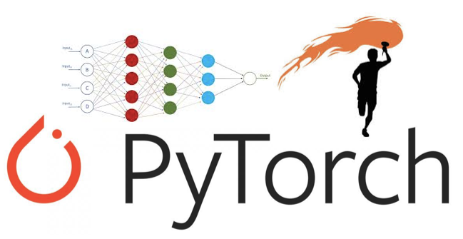

# Pytorch on Colab 
## Open notebooks in Google Colab  
  

* [00_pytorch_fundamentals.ipynb ](https://colab.research.google.com/github/omdgit/pytorch-deep-learning/blob/main/00_pytorch_fundamentals.ipynb)  
* [01_pytorch_workflow.ipynb](https://colab.research.google.com/github/omdgit/pytorch-deep-learning/blob/main/01_pytorch_workflow.ipynb) 
* [02_pytorch_classification.ipynb](https://colab.research.google.com/github/omdgit/pytorch-deep-learning/blob/main/02_pytorch_classification.ipynb)  
* [03_pytorch_computer_vision.ipynb](https://colab.research.google.com/github/omdgit/pytorch-deep-learning/blob/main/03_pytorch_computer_vision.ipynb) 
* [04_pytorch_custom_datasets.ipynb](https://colab.research.google.com/github/omdgit/pytorch-deep-learning/blob/main/04_pytorch_custom_datasets.ipynb) 
* [05_pytorch_going_modular.ipynb](https://colab.research.google.com/github/omdgit/pytorch-deep-learning/blob/main/05_pytorch_going_modular.ipynb) 
* [06_pytorch_transfer_learning.ipynb](https://colab.research.google.com/github/omdgit/pytorch-deep-learning/blob/main/06_pytorch_transfer_learning.ipynb) 
* [07_pytorch_experiment_tracking.ipynb](https://colab.research.google.com/github/omdgit/pytorch-deep-learning/blob/main/07_pytorch_experiment_tracking.ipynb) 
* [08_pytorch_paper_replicating.ipynb](https://colab.research.google.com/github/omdgit/pytorch-deep-learning/blob/main/08_pytorch_paper_replicating.ipynb) 
* [09_pytorch_model_deployment.ipynb](https://colab.research.google.com/github/omdgit/pytorch-deep-learning/blob/main/09_pytorch_model_deployment.ipynb) 

